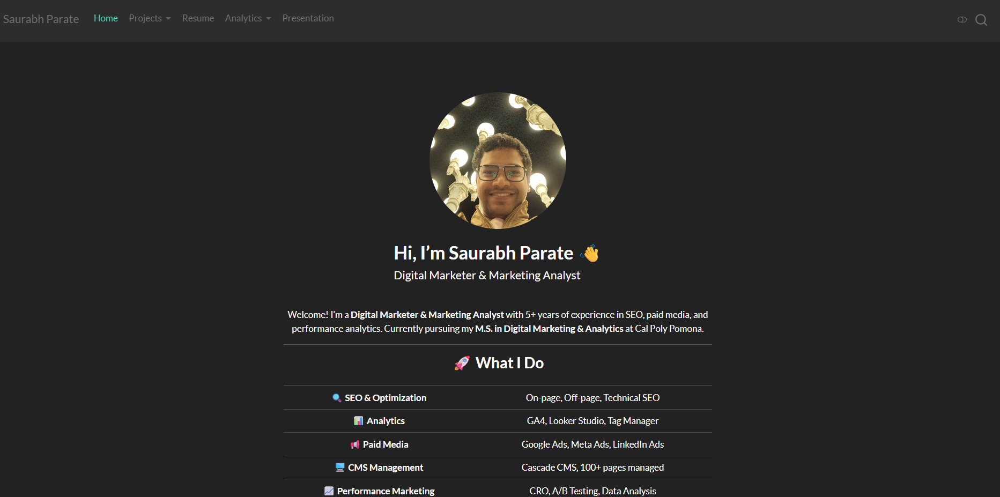
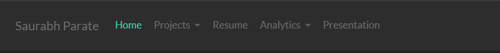

## 👋 About Me

- Digital Marketer & Marketing Analyst\
- M.S. in Digital Marketing & Analytics (CPP)\
- 4+ years of experience\
- Focus: SEO, Paid Media, and Data Analytics

------------------------------------------------------------------------

## 🎯 Target Audience

- Recruiters\
- Hiring Managers\
- Organizations looking for data-driven marketers

------------------------------------------------------------------------

## 🌐 Website Overview

- Built using Quarto\
- Professional portfolio showcasing:
  - Digital Marketing work\
  - Marketing Analytics projects\
  - Resume and contact information

------------------------------------------------------------------------

## 🧭 Website Structure

- Home\
- Projects
  - Digital Marketing\
  - Marketing Analytics\
- Resume\
- Analytics Dashboard
  - Website Traffic\
- Presentation

------------------------------------------------------------------------

## 🚀 Digital Marketing Experience

- Managed **100+ website pages**\
- Generated **600+ leads**\
- Managed **\$10K Google Ads Grant**\
- Experience across multiple industries

------------------------------------------------------------------------

## 📊 Marketing Analytics Project

Ontario Airport Analytics Project:

- Analyzed engagement vs passenger traffic\
- Built regression models\
- Created simulation scenarios\
- Estimated ROI impact

------------------------------------------------------------------------

## 📈 Key Insights

- Engagement strongly impacts passenger volume\
- +20% engagement → \~\$5.7M value\
- Fall & Summer show highest impact\
- Certain airlines respond more to engagement

------------------------------------------------------------------------

## 📉 Analytics Dashboard

- Built using Google Analytics 4\
- Visualized with Looker Studio\
- Tracks:
  - Users\
  - Traffic sources\
  - Engagement

------------------------------------------------------------------------

## 🎨 Design Philosophy

- Clean and simple layout\
- Easy navigation\
- Professional tone\
- Focus on clarity and usability

------------------------------------------------------------------------

## 🛠 Tools & Skills

- Google Ads, Meta Ads\
- Google Analytics, Looker Studio\
- R (data analysis & modeling)\
- SEO & CRO

------------------------------------------------------------------------

## 💡 Key Takeaway

I combine **marketing strategy + data analytics** to drive measurable business results.

------------------------------------------------------------------------

## 🙌 Thank You

- 📧 contact\@saurabhp.com\
- 💼 linkedin.com/in/saurabh-parate\
- 🌐 saurabhp.com
